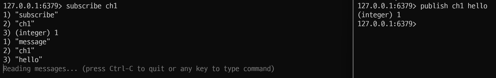

# 동시성 이슈 해결 알아보기

데이터 정합성을 맞추는 방법에 대해 알아보자.

## 1. synchronized
- 관련 코드: [StockService](src/main/java/com/example/stock/service/StockService.java)
- synchronized를 사용하면 하나의 프로세스 안에서 스레드 동시 접근을 막는다.

### synchronized를 사용할 때 주의점이 있다.
1. @Transactional를 사용할 경우
   - 스프링에서 Transactional Annotation을 이용하면 우리가 만든 클래스를
     래핑한 클래스를 새로 만들어서 실행하게 된다.
  
   - 코드상에서는 stockservice를 필드로 가지는 클래스를 새로 만들어서 실행한다.
  
   - 트랜잭션을 시작한 후에 메소드를 호출하고 메소드 실행이 종료가 된다면 트랜잭션을 종료하는데,
    
     트랜잭션 종료 시점에 데이터베이스에 업데이트업데이트 한다.

   - 메소드가 완료가 되었고 실제 데이터베이스가 업데이트 되기 전에 다른 Thread가 Decrease Method를 호출할 수 있다.
     - 다른 Thread는 갱신되기 전에 값을 가져가서 이전과 동일한 문제가 발생하는 것이다.
   - 이는 @Transaction 없으면 해결되긴 한다.
2. Java의 Synchronized는 하나의 프로세스 안에서만 보장한다.
    - 서버가 1대일 때는 데이터의 접근을 서버가 1대만 해서 괜찮겠지만,
      
      서버가 2대 혹은 그 이상일 경우는 데이터의 접근을 여러 대에서 할 수 있게 된다.
   
      싱크로나이즈드는 각 프로세스 안에서만 보장이 되기 때문에 
    
      결국 여러 스레드에서 동시에 데이터에 접근을 할 수 있게 되면서 레이스 컨디션이 발생하게 된다.

> 실제 운영 중인 서비스는 대부분 2대 이상의 서버를 사용하기 때문에
> Synchronized는 거의 사용하지 않는다.

## 2. Mysql 활용한 방법

1. Pessimistic Lock
    - 관련 코드: [PessimisticLockStockService](src/main/java/com/example/stock/service/PessimisticLockStockService.java)
    - 데이터에 Lock을 걸어 정합성을 맞추는 방법
      - `exclusive lock`을 걸게되면 다른 트랜잭션에서는 락이 해제되기 전에 데이터를 가져갈 수 없다.
        > 주의: 데드락
        > 
        > 서버가 여러 대가 있을 때 서버 1이 락을 걸고 데이터를 가져가게 되면 
        > 나머지 서버는 서버 1이 락을 해제하기 전까지 데이터를 가져갈 수 없다.
    - 장점: 충돌이 빈번하게 일어난다면 OptimisticLock보다 성능이 좋을 수 있다.
    - 단점: 별도의 락을 잡기 때문에 성능 감소가 있을 수 있다.
2. OptimisticLock
    - 관련코드: [OptimisticLockStockFacade](src/main/java/com/example/stock/facade/service/OptimisticLockStockFacade.java)
    - 실제로 락을 이용하지 않고 버전을 이용함으로써 정합성을 맞추는 방법
      - 먼저 데이터를 읽은 후 업데이트를 수행할 때 현재 내가 읽은 버전이 맞는지 확인하며 업데이트하는데, 
      
        만약 읽은 버전에서 수정사항이 생겼을 경우 어플리케이션에서 다시 읽은 후 작업 수행한다.
      > 1. 서버1이 데이터베이스에서 버전 1인 데이터를 읽어온다.
      > 2. 읽고 난 후 서버1이 업데이트 쿼리를 날린다.
      >   - 이때 update에 version +1 을 해주고 where에는 조건에 버전1 을 명시해주면서 업데이트 한다. 
      >     ```mysql
      >         update set version = version+1, quantity = 2
      >         from table 
      >         where version =1
      >     ```
      > 3. 서버2가 동일한 업데이트를 한다. 이때 version이 1이 아니기 때문에 수행이 되지 않는다.
      > 4. 업데이트가 실패하게 되면서 실제 어플리케이션에서 다시 읽은 후에 작업을 수행해야 하는 로직을 한다.
      >   - 내가 읽은 버전에서 수정사항이 생겼을 경우에는 애플리케이션에서 다시 읽은 후에 작업 수행한다는 뜻
    - 장점: 별도의 락을 잡지 않으므로 페시미스팅 락보다 성능상 이점
    - 단점: 업데이트가 실패했을 때 재시도 로직을 개발자가 직접 작성해 주어야 하는 번거로움
> 충돌이 빈번하게 일어난다면 혹은 충돌이 빈번하게 일어날 것이라고 예상된다면 Pessimistic Lock
> 
> 빈번하게 일어나지 않을 것이라고 예상된다면 OptimisticLock
3. Named Lock
    - 관련 코드: [NamedLockStockFacade](src/main/java/com/example/stock/facade/service/NamedLockStockFacade.java)
        > 실제로 사용하실 때는 데이터 소스를 분리해서 사용
        >
        > 같은 데이터 소스를 사용하면 커넥션 풀이 부족해지는 현상으로 인해서 다른 서비스에도 영향을 끼친다.
      - 이름을 가진 metadata locking
      - 이름을 가진 락을 획득한 후 해제할 때까지 다른 `session`은 이 락을 획득할 수 없도록 한다.
          - 별도의 공간에 락을 건다.
      - Pessimistic Lock은 row나 table단위로 lock을 걸지만, named lock은 메타데이터에 락킹을 하는 방법이다.
      - MySQL에서는 get-lock 명령어를 통해 named-lock을 획득할 수 있고 release-lock 명령어를 통해 lock을 해제할 수 있다.
        
    - Named Lock은 주로 분산락을 구현할 때 사용
    - 장점: Pessimistic Lock은 타임아웃을 구현하기 힘들지만 Named Lock은 타임아웃을 손쉽게 구현
    - 단점: 트랜잭션이 종료될 때 락이 자동으로 해제되지 않기 때문에 별도의 명령으로 해제를 수행해주거나 선점 시간이 끝나야 해제가 된다.
    > 트랜직션 종료 시에 락 해제, 세션 관리를 잘 해줘야 되기 때문에 주의해서 사용해야 하고 실제 구현 방법이 복잡할 수 있다.

## 3. Redis 활용하기
- dependency
```shell
implementation 'org.springframework.boot:spring-boot-starter-data-redis'
```
redis를 활용하여 동시성 문제를 해결할 때 사용하는 대표적인 라이브러리 두 가지

(분산락을 구현할 때 사용하는 대표적인 라이브러리 두 가지)

- MySQL의 Named Lock과 거의 비슷하나, redis를 이용하는 점과 Session 관리에 신경을 안 써도 된다는 차이가 있다.
1. Lettuce
    - 관련 코드: [LettuceLockStockFacade](src/main/java/com/example/stock/facade/service/LettuceLockStockFacade.java)
    - setnx 명령어를 활용해 분산락 구현
      > setnx(set if not exist) 명령어
      > 
      > 키와 밸류를 set할 때 기존의 값이 없을 때만 set하는 명령어
    - spin lock 방식: 락을 획득하려는 스레드가 락을 사용할 수 있는지 반복적으로 확인하면서 락 획득을 시도하는 방식
      - setnx를 활용하는 방식
      - retry로직을 개발자가 작성해주어야한다.
      > 방식
      > 
      > 1. 스레드 1이 키가 1인 데이터를 레디스에 셋하려고 한다.
      > 2. 레디스에 키가 1인 데이터가 없기 때문에 정상적으로 셋하게 되고 Thread1의 성공 리턴
      > 3. Thread2가 똑같이 키가 1인 데이터를 셋하려 할 때 레디스에 이미 키가 있어 실패 리턴
      > 4. Thread2가 락 획득에 실패를 하였기 때문에 일정 시간 이후에 락 획득을 재시도
      >    - 락 획득할 때까지 재시도를 하는 로직을 작성해 줘야 한다.
    - 장점
      - 구현이 간단
      - 스프링 데이터 레디스를 사용하면 lettude는 기본 라이브러리다.
    - 단점
      - 스피드락 방식이므로 동시에 많은 스레드가 락 획득대기 상태라면 레디스에 부하가 있을 수 있다.
        - sleep으로 락 획득 재시도에 텀을 준다.
2. Redisson
    - 관련 코드: [RedissonLockStockFacade](src/main/java/com/example/stock/facade/service/RedissonLockStockFacade.java) 
    - dependency
   ```shell
      implementation 'org.redisson:redisson-spring-boot-starter:3.27.2'
   ```
      - 락 관련된 클래스들을 라이브러리에서 제공해서 레파지토리 작성 안해도 된다.
    - pub-sub기반으로 Lock 구현
      > pub-sub기반: 채널을 하나를 만들고 락을 점유 중인 쓰레드가 
      > 락 획득하려고 대기중인 스레드에게 해제를 알려주면 안내를 받은 스레드가 락 획득 시도를 하는 방식
    - retry로직을 개발자가 작성하지 않아도 된다.
      > 1. 채널이 하나가 있고 스레드1이 먼저 락을 점유
      > 2. 스레드2가 이후에 시도를 하려고 한다
      > 3. Thread1이 락을 해제할 때 끝났다는 메시지를 채널로 보낸다.
      > 4. 채널은 Thread2에게 락 획득 시도해라는 걸 알려준다.
      > 5. Thread2는 락 획득을 시도한다.
    - 장점
      - lock 획득 재시도를 기본 제공 
      - PubSub 기반의 구현이기 때문에 레디스의 부하를 줄여준다.
    - 단점
      - 구현이 조금 복잡
      - 별도의 라이브러리를 사용해야한다.(스프링 데이터 레디스의 기본 라이브러리는 lettuce)
      - 락을 라이브러리 차원에서 제공을 해주어서 라이브러리 사용법 공부가 필요하다.

> 실무에서는 제시도가 필요하지 않은 락은 레튜스를 활용하여 구현하고
> 
> 제시도가 필요한 경우에는 레디슨을 활용하여 구현하는 방식을 혼용

> MySQL과 Redis 장단점
> - MySQL 
>   - 장점
>     - MySQL을 사용하고 있다면 별도의 비용 없이 사용
>     - 성능이 Redis보다는 좋지 않지만 어느 정도의 트래픽까지는 문제없이 사용 가능
> - 단점
>   - Redis보다는 성능이 좋지 않다
> - Redis
>   - 장점
>     - MySQL보다 성능이 좋기 때문에 더 많은 요청을 처리
>   - 단점
>     - 활용 중인 Redis가 없다면 별도의 구축 비용과 인프라 관리 비용이 추가 발생
> > 실무에서는 비용적 여유가 없거나 MySQL로 처리가 가능할 정도의 트래픽이라면 MySQL을 활용하고 
> >
> > 비용적 여유가 있거나 MySQL로는 처리가 불가능할 정도의 트래픽이라면 Redis를 도입
# docker로 redis 사용
### redis 설치 및 실행
```shell
$ docker pull redis
$ docker run --name myredis -d -p 6379:6379 redis
```
### redis 존재하는 이미지 실행
```shell
$ docker start myredis
```

### redis cli 실행
1. container id 확인
```shell
$ docker ps
```
2. redis cli 실행
```shell
$ docker exec -it {redis container id} redis-cli
```

## Lettuce
### redis cli 에서 lock
1. 키가 1인 데이터 setnx(key: 1, value: lock)
```shell
127.0.0.1:6379> setnx 1 lock
(integer) 1
127.0.0.1:6379> setnx 1 lock
(integer) 0
```
- 1이 성공 0이 실패
2. 키 1 삭제
```shell
127.0.0.1:6379> del 1
(integer) 1
127.0.0.1:6379> setnx 1 lock
(integer) 1
```

## Redisson
터미널 2개 활용해서 pub-sub 간단 실습하기
1. 한쪽에서 ch1을 구독
```shell
subscribe ch1
```
2. 다른 터미널에서 publish로 ch1에 hello 메시지 보내기
```shell
publish ch1 hello
```
3. ch1 구독한 채널에서 Hello라는 메시지 받음
4.  레디스는 자신이 점유하고 있는 락을 해제할 때 채널에 메시지를 보내줌으로써 
락을 획득해야 하는 스레드들에게 락 획득을 하라고 전달
5. 락 획득을 해야 하는 스레드들은 메시지를 받았을 때 락 획득을 시도
> 레튜스는 계속 락 획득을 시도하는 반면 
> 
> 레디스는 락 해제가 되었을 때 한 번 혹은 몇 번만 시도를 하기 때문에 레디스의 부하를 줄여준다.
